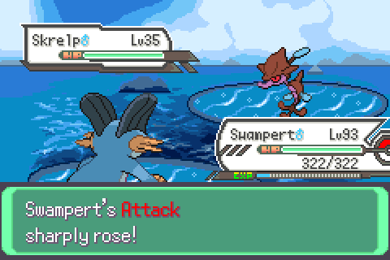
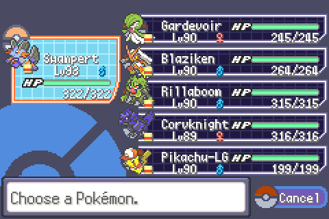
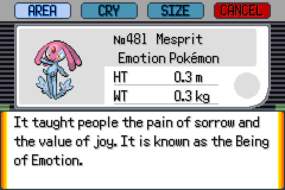
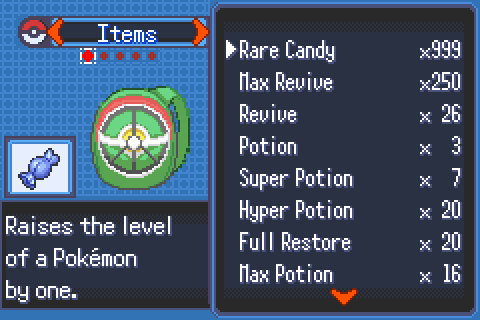
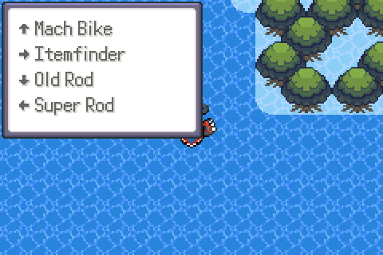
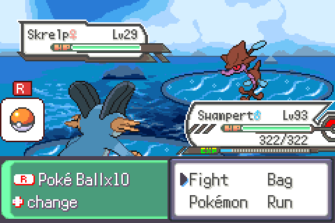
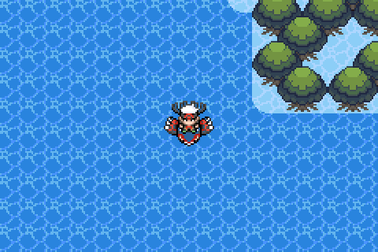
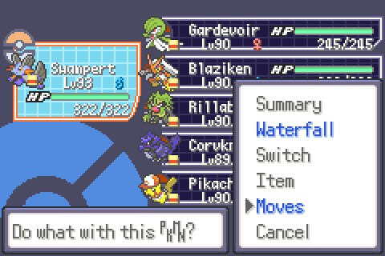
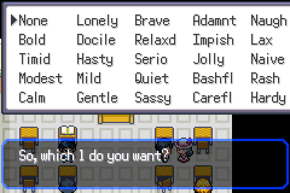

# Pokémon Hyper Emerald v5.7 (Lost Artifacts) — English + QoL patch

English translation and modern quality-of-life features for the Chinese Pokémon Emerald ROM hack
**Hyper Emerald: Lost Artifacts v5.7** (32 MB, game code `BPEE`), done as binary patches with no source access.

No ROMs or saves are included. You apply the patch to your own copy of `Hyper EMR LA v5.7 bugfix 2.gba`
(the Chinese hack, **not** vanilla Pokémon Emerald; see [Which ROM do I patch?](#which-rom-do-i-patch-read-this-first)).
Existing saves keep working.

<p align="center">
  
  
</p>

## Features

| Feature | Controls | Showcase |
|---|---|---|
| **Full English text** — ~6,000 leftover Chinese strings translated over two passes: post-game and Lost Artifacts (Volo/Arceus) story, Sinnoh, every Pokédex entry (960 species), items, abilities, moves, Battle Frontier and trainer dialogue. | — |  |
| **Bag sort** — cycles type → name → amount, with a message in the description box. | **START** in the bag |  |
| **Bag stack cap 999** — every pocket holds up to 999 per item (was 99). | — |  |
| **Register up to 4 key items** — a popup lists them on ↑ → ↓ ←. One registered item still works as in vanilla. | **SELECT** in the overworld |  |
| **Quick ball throw** — throws the first ball in your Poké Balls pocket without opening the bag. Hold R to see the ball and count; LEFT/RIGHT while holding picks another. A ball icon with an "R" badge marks the feature during the action menu. | **R** in a wild battle |  |
| **Auto-run toggle** — run without holding B. Persistent in the save, respects Running Shoes and map rules. | **R** in the overworld | — |
| **L quick repel** — asks "Use the Max Repel?" and falls back to Super Repel, then Repel. Silent when a repel is active or you have none. The hack's own "use another?" prompt still appears when one wears off. | **L** in the overworld |  |
| **In-party move relearner** — a *Moves* option in the party menu opens the Move Relearner for that Pokémon, using the hack's expanded move lists. No Heart Scale needed. | Party menu → **Moves** |  |
| **Nature changer, no quiz** — the Unova Gym Leader in the Rustboro Trainer's School hands out Galar Mints that change a Pokémon's nature, normally only after a run of random true/false questions. Talking to him now opens the Mint offer straight away, and it stays repeatable: pick a nature, pick a Pokémon, done. | Talk to him in Rustboro |  |
| **Coloured stat names** — Attack red, Defense orange, Speed light green, Sp. Atk pink, Sp. Def blue, Accuracy/Evasiveness yellow in every "rose"/"fell" message. | — |  |
| **OHKO / max-stat cheat** (optional, no ROM change) — pins your active Pokémon's Atk, Sp. Atk and Speed to 9999 in battle. | mGBA `.cheats`, RetroArch `.cht` | — |

## Guide website

A full player's guide lives in [`docs/`](docs/) and is published with GitHub Pages:
**https://nn-exe.github.io/Pokemon-Hyper-Emerald-5.7-QoL/** — install steps, every QoL feature, a walkthrough of Hoenn,
the post-game, Sinnoh and the Lost Artifacts questline, plus wild-encounter tables, boss teams and legendary locations
read straight from the ROM (`tools/romdata/`, `tools/build_site_data.py`; rebuild the search index with
`tools/build_search_index.py`).

## Install

> ### Which ROM do I patch? (read this first)
> **You must patch the Chinese hack, not vanilla Pokémon Emerald.** The patch only works on this exact file:
>
> | | |
> |---|---|
> | File | `Hyper EMR LA v5.7 bugfix 2.gba` (the "bugfix 2" build of Hyper Emerald: Lost Artifacts v5.7 from the hack's developer) |
> | Size | 33,554,432 bytes (32 MB) |
> | SHA-1 | `f785bed9d9e82e8da13ea4a5ad747e3ea4ec7ba9` |
>
> It will **not** work on:
> - vanilla **Pokémon Emerald (USA)** or any other official ROM (16 MB, different game entirely)
> - other Hyper Emerald releases (v5.6, v5.7 without bugfix, bugfix 1, etc.)
> - the older community English translation of Hyper Emerald (this patch already contains the full translation, so start from the untouched Chinese ROM)
>
> If the apply step prints `this is not the expected original ROM`, your file is one of the above. Check its SHA-1
> (`certutil -hashfile "your.gba" SHA1` on Windows, `sha1sum your.gba` on Linux/macOS) against the value in the table.

1. Get the original ROM `Hyper EMR LA v5.7 bugfix 2.gba` (33,554,432 bytes, sha1 in [release/CHECKSUMS.txt](release/CHECKSUMS.txt)).
2. Apply the patch (Python 3, no extra packages):
   ```
   python tools/romdiff.py apply "Hyper EMR LA v5.7 bugfix 2.gba" release/hyper-emerald-en-qol.hpatch "Hyper Emerald v5.7 EN+QoL.gba"
   ```
   The tool refuses to run on the wrong original and verifies the result's checksum.
3. Play in mGBA, RetroArch (mGBA core) or any GBA emulator. Your existing `.sav` works unchanged: emulators match saves by ROM file name, so name the new ROM like the old one or rename the save.

### Cheats (optional)
- mGBA: copy `cheats/OHKO.cheats` next to the ROM and rename it to `<rom name>.cheats`; it loads automatically.
- RetroArch: put `cheats/Hyper Emerald v5.7.cht` in the core's cheat folder and load it from Quick Menu → Cheats.

## Save compatibility

Game code that touches the save format is untouched. The new features keep their state in bytes the game never used
(register slots, auto-run flag). Battery saves (`.sav`) transfer between the original hack, the translation-only builds
and this build in either direction. Emulator save *states* (`.ss0`) do not transfer between different ROM builds.

## Known limitations

- The X-item result message ("Attack rose!") that this hack shows inside the bag window is drawn by the hack's own
  routine, which ignores colour codes, so it stays plain. Stat changes from moves and abilities are coloured.
- After using the in-party relearner you return to the overworld, not to the party menu.
- Roughly 50 referenced Chinese strings remain on purpose: link-battle and Trainer Card messages that end in a
  page-break control (rewriting those can hang the text engine), a few short name-table entries with no context, and
  image-baked text such as the title art.
- The game has been played through the areas the tests cover, not all 40+ hours; report anything odd with a screenshot.
- Patches from before 2026-09-14 crash in the new-game mountain cutscene ("Jumped to invalid address"); re-apply the
  current patch to a clean ROM. Saves are unaffected.

## Rebuild from source

Every feature is a standalone Python patcher that checks the exact bytes it expects before writing anything. They
must be applied in this order on top of the translated ROM (`translation/` produces it from the original):

```
pip install keystone-engine capstone pillow
python patches/bagsort/bagsort_patch.py       in.gba out1.gba
python patches/keyreg/keyreg_patch.py         out1.gba out2.gba
python patches/quickball/quickball_patch.py   out2.gba out3.gba
python patches/autorun/autorun_patch.py       out3.gba out4.gba
python patches/bagcap/bagcap_patch.py         out4.gba out5.gba
python patches/lrepel/lrepel_patch.py         out5.gba out6.gba
python translation/patch_remaining.py         out6.gba out7.gba   # second text pass (uses translation/plan_remaining.json)
python patches/relearner/relearner_patch.py   out7.gba out8.gba
python patches/statcolor/statcolor_patch.py   out8.gba out9.gba
python patches/movefix/movefix_patch.py       out9.gba out10.gba original.gba   # restores movement scripts the text passes overwrote
python patches/gfxfix/gfxfix_patch.py         out10.gba out11.gba original.gba  # restores compressed graphics the text passes overwrote
python patches/mintskip/mintskip_patch.py     out11.gba out12.gba
python tools/romdiff.py create original.gba out12.gba release/hyper-emerald-en-qol.hpatch
```

## How it was built (for other ROM hackers)

- The hack keeps vanilla Emerald layout for most engine code but wraps many functions with trampolines into its own
  code in the expansion area (0x09Dxxxxx). New features chain in front of those trampolines instead of patching the
  original bodies. [docs/NOTES.md](docs/NOTES.md) records every address, hook and gotcha.
- New code and text live in verified-unreferenced free space (checked with a full pointer scan, not just runs of
  0xFF: the hack holds live pointers into some "empty" regions).
- Every build is disassembled after assembly and rejected if the assembler emitted a 32-bit Thumb-2 instruction
  (the GBA CPU can't execute them; Keystone emits them silently for out-of-range immediates).
- Testing is automated: mGBA's Lua scripting drives the game (button sequences, memory reads, watchpoints,
  screenshots). Each feature folder has its `test_*.lua`; the showcase images come straight from those runs.
- Translation: strings are extracted with the hack's two-byte GB2312 encoding, translated in JSON batches, re-encoded
  to the Gen 3 charmap with automatic line wrapping sized from each text box, and relocated with pointer repoints.
  Text box sizes are inferred from the English neighbours in the same pointer table.

## Layout

```
release/      hyper-emerald-en-qol.hpatch + CHECKSUMS.txt   (apply with tools/romdiff.py)
tools/        romdiff.py                                     (create/apply compact ROM diffs)
patches/      one folder per feature: *_patch.py, *.s source, test_*.lua
cheats/       OHKO cheat for mGBA (.cheats) and RetroArch (.cht)
translation/  extraction/insertion pipeline, translation JSON, audit + second-pass scripts
docs/         NOTES.md (engineering log), showcase/ (images)
CHANGELOG.md  what changed when
```

The `test_*.lua` scripts contain absolute paths from the development machine; edit the `dir` line at the top before
running them with `mGBA.exe --script test.lua rom.gba` (an mGBA build with scripting is required).

## License

The scripts, tools, docs and translation data are released under the [MIT License](LICENSE). The game and the
hack are not covered and are not distributed here.

## Credits

- Hyper Emerald: Lost Artifacts is the work of its original Chinese authors; this repository only distributes a patch.
- **All the credits for the previous translation and for fixing the earlier bugs go to Luciano Fire, Helper, Gustavo Neves and Li Yun.** Their community English translation (up to Champion Island) was the starting point for this build; everything here is layered on top of their work.
- Tools: mGBA, Capstone, Keystone, Python.
